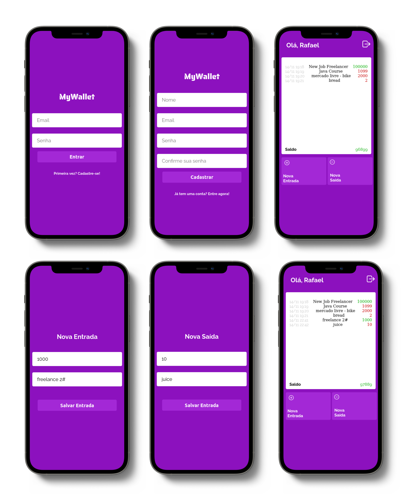
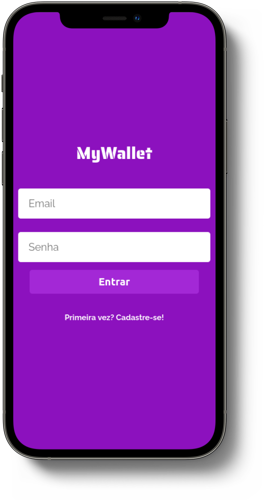
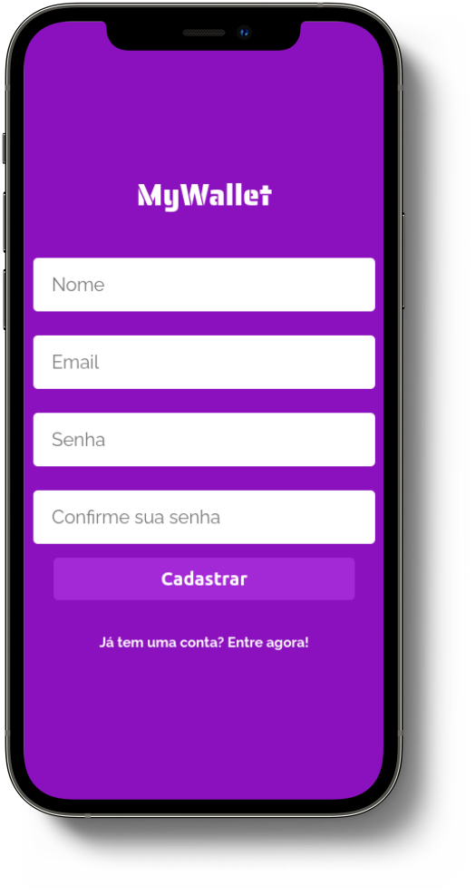

<p align="center">
 
</p>

<h3 align="center">MyWallet</h3>

<div align="center">

[]()
[](https://github.com//raferdev/batepapo-uol-api/issues)
[](https://github.com/raferdev/batepapo-uol-api/pulls)
[](/LICENSE)

</div>

---
<p align="center">
 
</p>

--- 
<p align="center"> 
This is a frontend part of FullStack project. The backend you can see <a href="https://github.com/raferdev/mywallet-back">here</a>. This project was built using ReactJS, and simulate one wallet service, which user can register payments, transactions, and see your account history.
</p>

---

## 📝 Table of Contents

- [About](#about)
- [Getting Started](#getting_started)
- [Usage](#usage)
- [Built Using](#built_using)
- [Authors](#authors)

---

## 🧐 About <a name = "about"></a>

This project was built on one week and encrease my consepts about javascript enviroment, using ReactJS, and NodeJS to create one web app completly. This frontend simulate one web app that user can create one account and register acount transactions.You can clone and run the project on your machine but backend is required <a href="https://github.com/raferdev/mywallet-back">(link)</a>.

---

## 🏁 Getting Started <a name = "getting_started"></a>

You can clone the project and start on your local host like below.

### Prerequisites
You need install ***GIT*** if you don't already have, to clone project,.

<a href="https://git-scm.com/downloads">Click here</a> or Acess: 

```
https://git-scm.com/downloads
```


You need install ***Docker*** on your machine if you don't already have.

<a href="https://docs.docker.com/get-docker">Click here</a> or Acess: 
```
https://docs.docker.com/get-docker/
```
And use the step-by-step doc to download and install on your specific system.

### Installing

1 - Clone on your local system

 ```
 git clone https://github.com/raferdev/batepapo-uol-api
 ```

2 - Go to project path 

```
cd batepapo-uol-api
```

3 - Create env file

You can rename the ".env.exemple" file to ".env", just removing ".exemple" and save, or follow this steps to create new one:

- Open a text editor or other editor do you prefeer, create this variables like below and save file with name '.env'.


 ```
REACT_APP_HTTP=http://localhost:5000/
```
You can change the values of variables if you want or need.

### Start

Use on terminal:
```
npm start
```
*The attached console will show:*
```
Starting the development server...

Compiled successfully!
 
You can now view mywallet-front in the browser.

Local:            http://localhost:3000
On Your Network:  http://172.22.0.2:3000

Note that the development build is not optimized.

webpack compiled successfully
```

---
## 🎈 Usage <a name="usage"></a>

Now you can access the route below on browser:

```
http://localhost:3000/
```

- **GUIDE** : 

    

   - **/route** - the path route did you can acess using your host

```
- Here you can see the
description of what you 
can do on this page.


```

---
  **Exemple:**


- **/sign-in**

    

    ```
    INPUT:
    - Email = If you have a 
    valid registered email 
    you can put here.
    - Password = If you have one 
    registered email you can put
    the respective password here.

    BUTTON:
    - "Entrar": Send request to 
    signin when you put one email
    and password.

    LINK:
    - "Primeira vez?
       Cadastre-se!": 
    Here you can use if you won't
    have one
    registered accont yet (your 
    fisrt time using the app)

    ```

  ---

  **Usage** 
  - On all frontend access you will use GET method, it's just copy and paste the route on browser or use by clicking on the buttons and links. In this case you will make a request on *http://localhost:3000/signin* to see and interact with the page using by the above instructions.
  
  ---

**LET'S GO** - API description.

- **/sign-in**

    

    ```
    INPUT:
    - Email = If you have a 
    valid registered email 
    you can put here.
    - Password = If you have one 
    registered email you can put
    the respective password here.

    BUTTON:
    - "Entrar": Send request to 
    signin when you put one email
    and password.

    LINK:
    - "Primeira vez?
       Cadastre-se!": 
    Here you can use if you won't
    have one
    registered accont yet (your 
    fisrt time using the app)
    ```
---
- **/sign-up**

    

    ```
    INPUT:
    - Name = Put your name here.
    - Email = Put your email.
    - Password = .

    BUTTON:
    - "Entrar": Send request to 
    signin when you put one email
    and password.

    LINK:
    - "Primeira vez?
       Cadastre-se!": 
    Here you can use if you won't
    have one
    registered accont yet (your 
    fisrt time using the app)
    ```


<div>

</div>


## ⛏️ Built Using <a name = "built_using"></a>

- [ReactJS](https://pt-br.reactjs.org/) - Super Library Javascript
- [CSS](https://developer.mozilla.org/pt-BR/docs/Web/CSS) - Style Language
- [Docker](https://www.docker.com/) - Container Technology


---
## ✍️ Authors <a name = "authors"></a>

- [@raferdev](https://github.com/raferdev)
